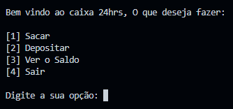
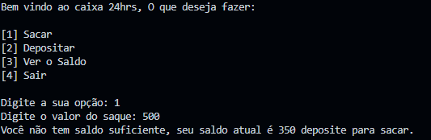
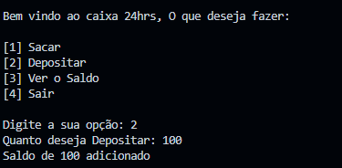
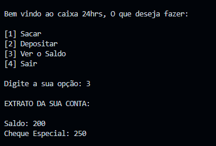
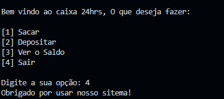

# 💰 Caixa Eletrônico 24 Horas 💳

### Sobre o Projeto 🚀

Este projeto foi desenvolvido com propósitos educacionais, visando colocar em prática meus conhecimentos sobre a linguagem Python. É uma simulação de um caixa eletrônico 24 horas, com funcionalidades básicas.

### Tecnologias Utilizadas 🛠️

- Python 3
- VSCode

### Como Funciona 🔄

O funcionamento do caixa eletrônico envolve entrada de dados e processamento matemático das informações:

1. Todo o código está envolto em uma estrutura de repetição `while`, tornando-o mais interativo. São apresentadas 4 opções: saque, depósito, extrato e sair.



2. Na opção de saque, o usuário digita o valor desejado e o programa verifica se o saldo é suficiente. Se não for, o cheque especial entra em jogo. Lembrando que ao sacar, o saldo é diminuído e se o cheque especial for utilizado, o usuário ficará devendo ao banco.



3. Na opção de depósito, um valor é adicionado ao saldo. Lembrando que se houver dívida no cheque especial, o banco cobrará.



4. A opção de extrato mostra o extrato atual da conta.



5. A quarta opção é para sair do programa.



Eu tentei descrever a funcionalidade de forma mais simples possível, mas se tiverem sugestões de melhoria, estou à disposição! 🤓

### Como Instalar e Executar 🚀

1. Clone este repositório:

```shell
$ git clone https://github.com/zSantz/caixa-24horas.git
```

2. Navegue até o diretório do projeto:

```shell
$ cd caixa-24horas   
```

3. Execute o arquivo Python:

```shell
$ python .\main.py
```

### Referências e Contato📚

- [Bootcamp de Python - DIO](https://web.dio.me/track/8b170530-da6f-487f-8774-c0bc58254f6c)
- [Meu Linkedin](https://www.linkedin.com/in/augustocesar-sf/)
- [Meu Instagram](https://www.instagram.com/elninosantz)
- [Meu Twitter](https://twitter.com/elSanttz)
